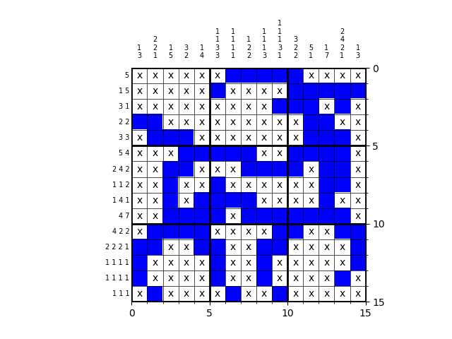

# Nonogram_solver
A simple code to solve nonogram puzzles like this



To use the code, define the puzzle by specifying the `top_digits` organized as `[[column1], [column2],...]` and `side_digits` organized as `[[row1], [row2],...]`.

Example of the code usage:
```python
import Nonogram_solver

# define puzzle
top_digits = [[1,3],[2,2,1],[1,5],[3,2],[1,4],[1,1,3,3],[1,1,1,1],[1,2,2],[1,1,1,3],[1,1,1,3,1],[3,2,2],[5,1],[1,7],[2,4,2,1],[1,3]]
side_digits = [[5],[1,5],[3,1],[2,2],[3,3],[5,4],[2,4,2],[1,1,2],[1,4,1],[4,7],[4,2,2],[2,2,2,1],[1,1,1,1],[1,1,1,1],[1,1,1]]
my_nonogram = Nonogram_solver.Nonogram(top_digits, side_digits)

# solve puzzle
my_nonogram.solve()

# plot solution
my_nonogram.plot_field()
```


