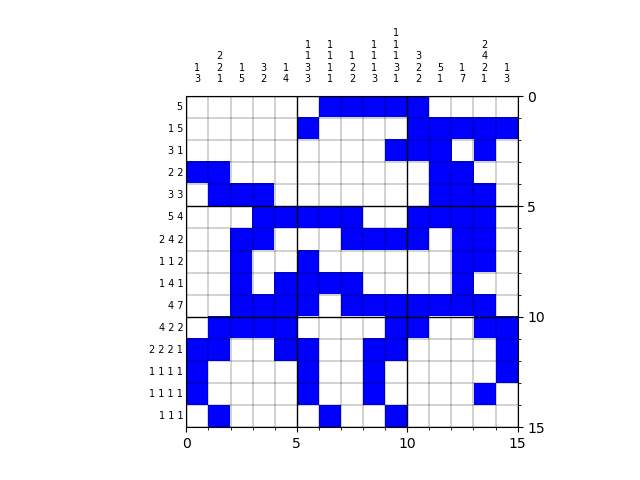

# Nonogram solver
A simple code to solve [nonogram puzzles](https://en.wikipedia.org/wiki/Nonogram) like this



# Getting started
Install the necessary libraries:
```
pip install -r requirements.txt
```

Try out an example puzzle:
```
python examples/antelope/examle.py
```

# Example of code usage
To solve the puzzle displayed above, we need to input the numbers:
- `top_nums`: columns on the top organized as `[[column1], [column2],...]`
- `side_nums`: rows on the left organized as `[[row1], [row2],...]`:

```python
top_nums = [
    [1,3],
    [2,2,1],
    [1,5],
    [3,2],
    [1,4],
    [1,1,3,3],
    [1,1,1,1],
    [1,2,2],
    [1,1,1,3],
    [1,1,1,3,1],
    [3,2,2],
    [5,1],
    [1,7],
    [2,4,2,1],
    [1,3]
    ]
side_nums = [
    [5],
    [1,5],
    [3,1],
    [2,2],
    [3,3],
    [5,4],
    [2,4,2],
    [1,1,2],
    [1,4,1],
    [4,7],
    [4,2,2],
    [2,2,2,1],
    [1,1,1,1],
    [1,1,1,1],
    [1,1,1]
    ]
```

After this, solving the puzzle is simply done with
```python
from nonogram_solver import Nonogram
my_nonogram = Nonogram(top_nums, side_nums)

# solve the puzzle
my_nonogram.solve()

# plot the solution
my_nonogram.plot_field()
```

For large puzzles that can take exponentially long time to solve, a feature is implemented to skip rows that allow too many possible combinations and return to them later. For this, a parameter `skip_threshold` can be specified when solving the puzzle (`30_000_000_000` by default):
```python
my_nonogram.solve(skip_threshold=30_000_000_000)
```


